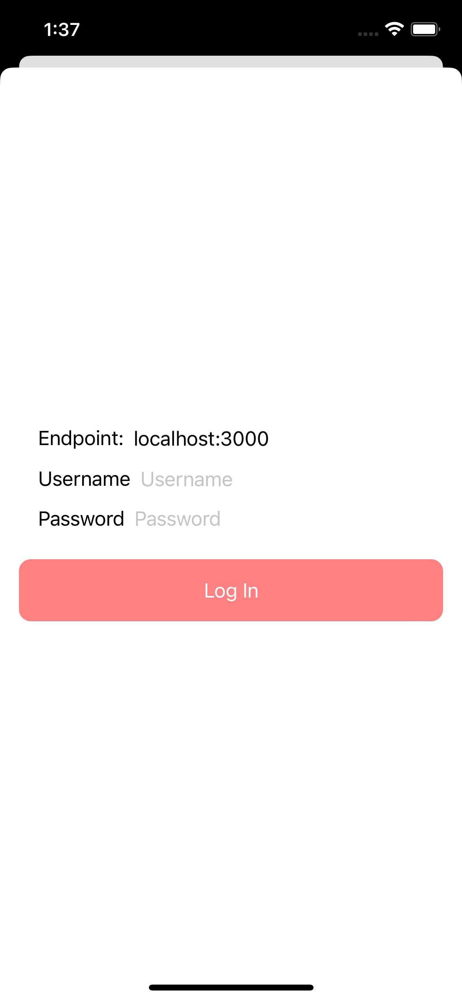
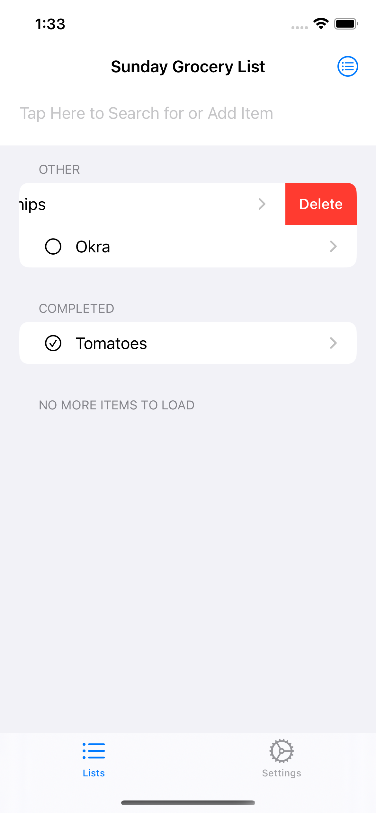
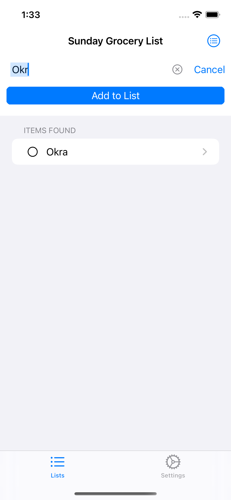
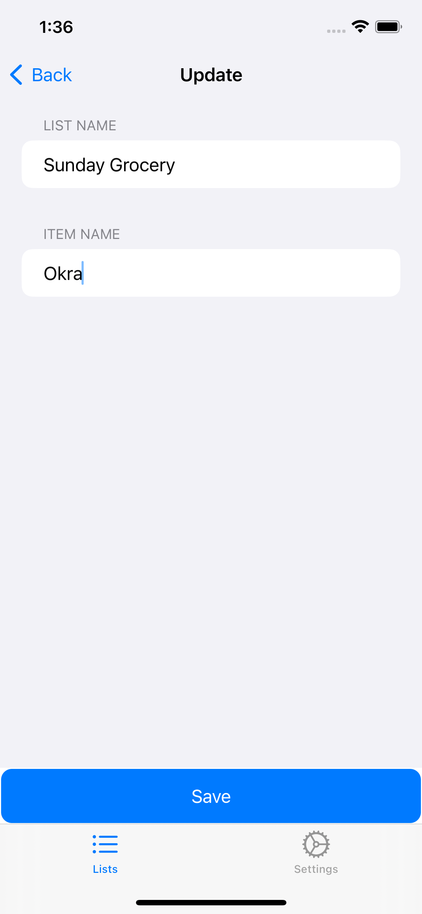

# newb_cook-ios

# Project Goal
A private method of sharing a list of items with family/friends which communicates with a trusted backend/server which you (or someone you know) owns.

# Project State
This open source project allows for a group of people to share lists which communicates with newb_cook-backend. The app cannot be run without the backend, but running an instance is straight forward by using Docker container or installing directly within linux. The backend can be installed on a local network or by a trusted source so that lists can be shared with multiple people. 

<b>Note</b>: If the backend is run on a local network connecting to the machine will require that VPN be setup or the application will not be accessible from outside the local network (how to setup VPN is outside the scope of this README).

It is possible to do the following things with the app.
* Allow for different users to login to manage their own lists.
    * See newb_cook-backend for more details on how to create new users.
* Create/Rename/Delete multiple lists
* Create/Rename/Delete items for lists
* Logout user for a new user to login.

# How to Run in a Simulator
1. Start the newb_cook-backend
1. Open the xcode project on a mac which supports Xcode 14.2 or greater.
1. Select the simulator device to run and click the run button.
1. Input the credentials for the application
    1. If running newb_cook-backend on the same machine the simulator is running, hostname will be localhost:3000
    1. If no changes were made to newb_cook-backend before running for first time, a user "test" with password "test" will be created
1. Upon logging in create a list with items.
1. Visit newb_cook-backend to understand how to share a list with other users

# Images of The Application

# Things to do
* Add a new section to indicate that items in the pantry have been consumed.
* Add the use of Keychain APIs to store user credentials and touch/face ID.
* Add functionality to integrate with ChatGPT for food recommendations with the list items in pantry.
* Create a button which to find users on the system to share a list with.
* Ensure the app is 80%+ code coverage.

# Want to Help?
* Reach out to me at [https://github.com/blackjackfruit](https://github.com/blackjackfruit) or if not raise an Issue on github for me to look into for suggestions.